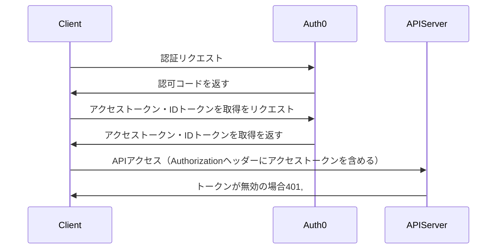

### OIDC認証

Auth0を使用したOIDC認証



* 使用ライブラリ：@auth0/auth0-react
(1) クライアントが OIDC 認証でアクセストークンを取得
(2) クライアントが `Authorization: Bearer <access_token>` を API に送信
(3) API サーバーがトークンを検証
      - 署名の確認 (JWKS)
      - 有効期限 (`exp`)
      - 発行者 (`iss`)
      - 対象 (`aud`)
(4) トークンが有効なら API を実行
(5) 無効なら `401 Unauthorized` を返す

##### 認可コード

##### アクセストークン・IDトークン
Auth0のアクセストークン（JWT）はクライアント側のどこに保存されるのか？
    -> @auth0/auth0-react はメモリキャッシュを使用している。（ログイン状態がリロードしても維持される）
##### APIアクセス

```[typescript]
<Auth0Provider
    domain={import.meta.env.VITE_APP_AUTH0_DOMAIN}
    clientId={import.meta.env.VITE_APP_AUTH0_CLIENT_ID}
    authorizationParams={{
        audience: import.meta.env.VITE_APP_AUTH0_AUDIENCE,
        redirect_uri: `${window.location.origin}/oidc`,
    }}
>
    <OidcPage />
</Auth0Provider>
```


### 参考
* [Build and Secure a FastAPI Server with Auth0](https://auth0.com/blog/build-and-secure-fastapi-server-with-auth0/)