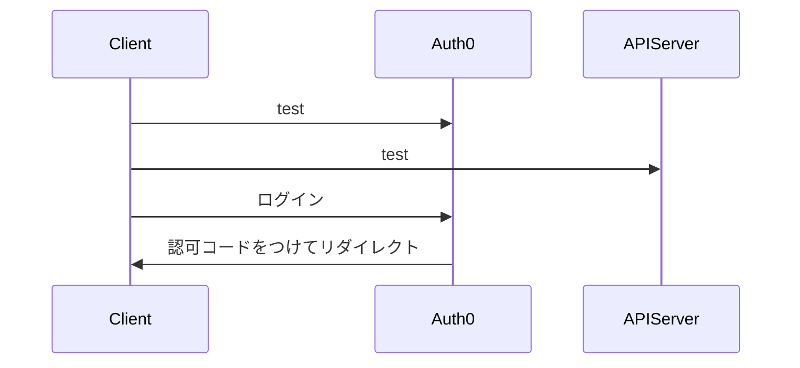

### OIDC認証

Auth0を使用したOIDC認証

参考実装：[Build and Secure a FastAPI Server with Auth0](https://auth0.com/blog/build-and-secure-fastapi-server-with-auth0/)



* 使用ライブラリ：@auth0/auth0-react
* Auth0のアクセストークン（JWT）はクライアント側のどこに保存されるのか？
    -> @auth0/auth0-react はメモリキャッシュを使用している。（ログイン状態がリロードしても維持される）
* 

```[typescript]
<Auth0Provider
    domain={import.meta.env.VITE_APP_AUTH0_DOMAIN}
    clientId={import.meta.env.VITE_APP_AUTH0_CLIENT_ID}
    authorizationParams={{
        audience: import.meta.env.VITE_APP_AUTH0_AUDIENCE,
        redirect_uri: `${window.location.origin}/oidc`,
    }}
>
    <OidcPage />
</Auth0Provider>
```